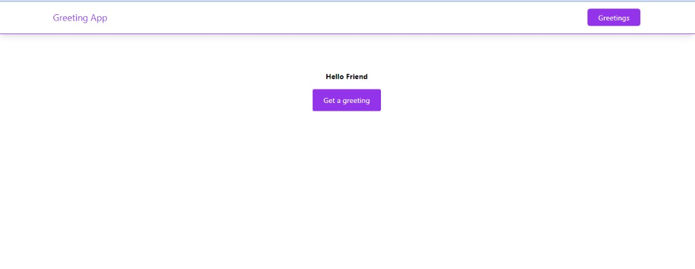
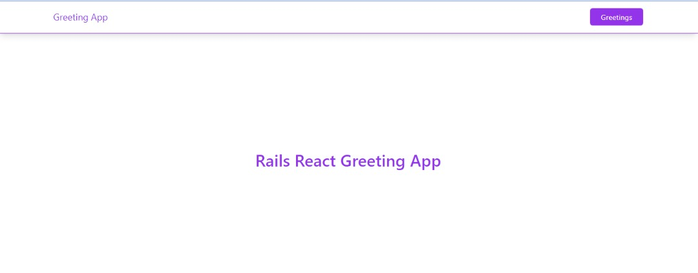

# RAILS-REACT GREETING APP

This is a practice project to implement a connection between a Ruby on Rails back-end and React front-end.

#### App Screenshots

<table>
  <tr>
    <td>Home Page</td>
     <td>Greeting</td>
  </tr>
  <tr>
    <td></td>
    <td></td>
  </tr>
 </table>
# Getting Started

_To get a local copy up and running follow these simple steps._

1. Clone this repo
   ```sh
   git clone https://github.com/KingsleyIbe/hello-react-backend.git
   ```

2. Clone the [frontend repo](https://github.com/KingsleyIbe/hello-react-front-end.git)
   ```sh
   git clone https://github.com/KingsleyIbe/hello-react-front-end.git
   ```

   - The API URL to greetings
   ```sh
   http://localhost:3000/v1/greetings
   ```
3. Goto project directory
   ```sh
   cd hello-react-backend
   ```

4. Run
   ```sh
   gem install bundler
   ```

5. Then run
   ```sh
   bundle install
   ```

   - To start the server, Run
   ```sh
   bundle install
   ```

# This project was built with

- Ruby
- Ruby on Rails
- React
- PostgreSQL
- Webpack
- Gem Bundle
- Node
- NPM
- Tailwind css

# Author

👤 **KingsleyIbe**

- GitHub: [KingsleyIbe](https://github.com/KingsleyIbe)
- Twitter: [Twitter](https://twitter.com/ibekingsley2)
- LinkedIn: [LinkedIn](https://www.linkedin.com/in/kingsley-ibe/)

# 🤝 Contributing

Contributions, issues, and feature requests are welcome!

Feel free to check the [issues page](https://github.com/KingsleyIbe/hello-react-backend/issues).

# Show your support

Give a ⭐️ if you like this project!

# Acknowledgement

- Hat tip to anyone whose code was a source of inspiration.
- A big thanks to [microverseinc](https://github.com/microverseinc).

# 📝 License

This project is [MIT](./MIT.md) licensed.
